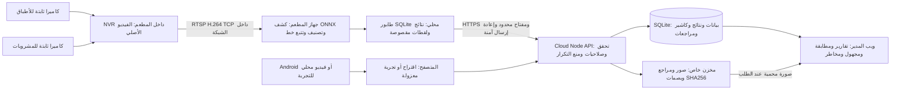

# IEP Vision — ملف المشروع والمراجعة النهائية 0.4

آخر تحديث: 2026-10-09. يصف هذا الملف التنفيذ الحالي، والإصلاحات وأدلتها، وما يحتاج قبولًا ميدانيًا. [دليل التنفيذ بالأوامر والأجهزة والتشخيص](EXECUTION_GUIDE.md) هو المرجع العملي للتركيب. احتُفظ بـ[المراجعة السابقة للإصلاحات](PROJECT_REVIEW_2026-10-09_BEFORE_FIXES.md) للتتبع؛ حالتها لا تمثل النسخة الحالية.

## قرار الجاهزية

أُصلحت عيوب البرنامج المثبتة. اختُبر الربط التجريبي بين الفيديو ومحرك ONNX وAPI والنتائج والصور، كما اختُبرت قراءة H.264 عبر RTSP والانقطاع والعودة محليًا. أصبح للمشروع عامل تحليل داخل المطعم، وخدمات بدء تلقائي، وقوالب Docker وHTTPS، ونسخ احتياطي، وتشخيص، ودليل تركيب.

**المشروع جاهز لبدء تركيب تجريبي منظم؛ لم يحصل بعد على قبول للعد الآلي في مطعم حقيقي.** لم تتوفر بيانات أصناف العميل، أو أجهزة NVR وAndroid فعلية، أو استضافة ونطاق يملكهما العميل. لم يُنجز تشغيل متواصل لمدة 24 ساعة، أو تدريب كاشف خاص بالمطعم، أو تكامل مع مورد كاشير محدد، أو نشر عام. تحتاج هذه الخطوات بيانات وعتادًا وموقعًا؛ نجاح اختبارات الكود لا يستبدلها. لا يوجد وعد بدقة 100%، ولا يُعد الفرق المالي وحده إثباتًا للسرقة.

## الهدف ووحدة العد

تخدم IEP عدة عملاء ومطاعم. التصميم المستهدف لكل مطعم: نقطة ثابتة لخروج الأطباق، بعرض لا يتجاوز مترًا، وبحد أقصى أربعة عناصر في الوقت نفسه، ونقطة مشابهة لخروج المشروبات. وحدة العد هي **عنصر خرج في الاتجاه المحدد عبر خط عند نقطة الخدمة**. عدد الطلبات، ووجود عناصر في صورة ثابتة، وتكرار ظهور العنصر في الإطارات، والمحتوى المخفي داخل كوب، أمور مختلفة عن هذه الوحدة.

يحفظ التتبع هوية مشاهدة داخل منظور ثابت. لا يضمن هوية الطبق نفسه بعد حجب طويل، أو عودة، أو إعادة تقديم، أو انتقال إلى كاميرا أخرى، أو إعادة تشغيل. يجب الاتفاق مع المطعم على طريقة احتساب الصواني والكومبو والهالك والإلغاء بعد الخروج. الموبايل المتحرك يعرض تعرفًا مقترحًا ويحتاج تأكيدًا يدويًا؛ الصورة الثابتة تجربة حضور وليست سجل خروج يوميًا.

## مكان كل خطوة في النظام

يسجل الـNVR الفيديو؛ لا يشغّل برنامج IEP. يتصل جهاز التحليل بشبكة المطعم ويسحب القناة، دون رفع فيديو اليوم أو تخزين نسخة إضافية منه. يرسل النتائج واللقطات إلى الكلود عبر اتصال HTTPS صادر. لا تفتح RTSP أو واجهة الـNVR للإنترنت.

يحتاج جهاز المدير متصفحًا فقط. لا يلزم تطبيق Android أصلي للوحة، ولا إذن ميكروفون. لا يفتح Chrome بث RTSP مباشرة؛ عامل التحليل هو الذي يفك البث.

## الوظائف المنفذة وما يحتاج قبولًا أو تطويرًا

| الوظيفة | الحالة الحالية |
|---|---|
| واجهة عربية، عدة عملاء ومطاعم، حسابات وأدوار | منفذة مع عزل على الخادم ومفاتيح محدودة الصلاحيات. |
| كتالوج أطباق ومشروبات وأشياء وأشخاص، وصور تقديم متعددة | منفذ؛ يرتبط المرجع بـ`dishId` ثابت. إضافة الصور ليست تدريبًا لكاشف جديد. |
| نموذج COCO ذو 80 فئة، وتجارب المتصفح للفيديو والصورة والموبايل | منفذة؛ حدود الكاشف معلنة. لا توجد فئة `plate` في COCO. |
| عامل Python وONNX لمصادر RTSP وUSB والملفات | منفذ؛ مصدر ثابت لكل خدمة، ومراقبة لتعطل فك البث، واستخدام أحدث إطار للبث الحي، وتوقيت PTS للمقاطع. |
| تتبع عدة صناديق، وخط واتجاه، وحالات مجهولة | منفذ ومختبر برمجيًا؛ صحة العد في مطعم فعلي غير معتمدة. |
| نماذج مخصصة وملفات تعريف للنماذج | يدعم عقد YOLOX أو `xyxy` والبصمة والفئات؛ لا يوجد تدريب أو تنزيل تلقائي لنموذج مطعم خاص. |
| تجربة مقطع من أصل تسجيل الـNVR | تجربة معزولة لها بصمة وبداية زمنية صريحة وإعادة آمنة؛ لا تعوض اليومية تلقائيًا. |
| طابور دائم، ومنع تكرار، وإصلاح حفظ الصورة | منفذة؛ امتلاء الطابور أو القرص، أو توقف التصوير، يوقف العد ويترك فجوة. |
| حجز مصدر RTSP أو USB وتقييد العامل المنتج | منفذ لمنع عاملين صالحين من معالجة المصدر في الفترة نفسها. إذا انقطع الكلود وانتهى الحجز، يتوقف العد الجديد. |
| مصادر تصوير وحالة ربط وفجوات وتشخيص محلي | منفذة؛ صحة الاتصال لا تثبت دقة العدد. |
| بيانات كاشير يدويًا أو عبر CSV وAPI، ومقارنة واعتماد | منفذة؛ لا يوجد موصل لمورد كاشير محدد، أو ربط لكل طبق بـ`orderId`. |
| صور مستقلة ونسخ وفحص واستعادة | منفذة مع SHA وصلاحيات وصول. توجد قوالب جدولة؛ لا توجد نسخة خارجية منشورة. |
| Docker بمستخدم غير جذر، وCaddy لـHTTPS، وخدمات العامل | منفذة ومختبرة محليًا بـCompose وTLS موثوق؛ النطاق وشهادة TLS العامة والجهاز الحقيقي تحتاج تركيبًا. |
| اكتشاف ONVIF، وAPI لتشغيل تسجيلات الـNVR، واستدراك آلي للفجوات | غير منفذة. ONVIF ليس شرط تشغيل إذا ثبت توفر RTSP المتوافق. |
| PostgreSQL وS3 وGPU واحتفاظ آلي وتنبيهات خارجية وفوترة | ليست مكونات مفعلة في هذه النسخة. |

## إغلاق المراجعة السابقة

الإغلاق هنا لإصلاح الكود واختبار منع رجوع العيب؛ لا يعني اكتمال قبول الأجهزة والدقة. الملفات والاختبارات محفوظة في Git. تغيير حالة بند في الوثيقة وحده لا يغلق العيب.

| البند | الإصلاح والدليل |
|---|---|
| REV-01 | توحيد هوية العبور بين المعروف والمجهول. تؤدي ترتيبات الوصول والتأكيد المختلفة إلى عدد واحد. يحفظ الترحيل الأدلة ويزيل العد المكرر القديم. |
| REV-02 | فصل هوية التشغيل عن التجارب بمكونات محددة النوع، بدل بادئة نصية قابلة للتصادم. يوجد اختبار لتصادم اسم جلسة محجوز. |
| REV-03 | رفض مجلدات البيانات والصور داخل `public`، ورفض الروابط الرمزية أو الآباء غير الآمنين. تقييد الملفات العامة بمسارها الحقيقي واختبارات GET سلبية. |
| REV-04 | التحقق من جيل التشغيل والحساب والمطعم خلال انتظار إذن الكاميرا وبدء المراقبة. تتوقف مسارات الكاميرا المتأخرة ويُغلق سجل المراقبة القديم. |
| REV-05 | تنفيذ عامل ONNX ومسار أحدث إطار. يوقف المتصفح العد عند بطء وتيرة التحليل. الحل الهندسي منفذ؛ قبول الأداء الحي على عتاد المطعم ما زال مطلوبًا. |
| REV-06 | عرض ملخص الصورة المحفوظة من التاريخ بعد إعادة تحميل الصفحة، بمعرفات أصناف ثابتة ودون تسجيل خروج. |
| REV-07 | تثبيت إعدادات وكتالوج ومراجع التجربة. تعديل الإعدادات يوقف التشغيل قبل معالجة إطارات أخرى. |
| REV-08 | إصلاح حالات `pending` و`missing` و`corrupt` فقط بعد التحقق من SHA. تصحح الاستعادة الحالات قبل أول GET. |
| REV-09 | فهارس `image_key` في الجداول الثلاثة، وتجنب تحديث الحالة الجاهزة بصورة متكررة. |
| REV-10 | تدقيق إضافة المرجع وحذفه مع المستخدم والمفتاح والبصمة. حفظ أصل إعدادات المراجع والصورة والفيديو، وحماية ربط ملف التجربة من التغيير. |
| REV-11 | التحقق من بنية الكائن والتوقيت كقيمة ISO لها منطقة زمنية صريحة. القيم الفارغة، والتاريخ غير الموجود، والوقت غير الصالح، تعيد 400. |
| REV-12 | إعادة إرسال الهوية نفسها بمحتواها الأصلي آمنة. تغيير الصنف أو الوقت أو الكاميرا أو الوضع أو الثقة يعيد 409 بدل نجاح صامت. |
| REV-13 | صلاحيات 700 لمجلدات البيانات والصور، و600 لملفات DB وWAL وSHM، وحاويات بمستخدم غير جذر، مع الحفاظ على الآباء المشتركة. |
| REV-14 | حساب SHA بدفعات 1 MiB، وقراءة SQLite تدريجيًا، والتحقق بواسطة Map بتكلفة خطية. لا تُحمّل قاعدة البيانات كاملة إلى الذاكرة. |
| REV-15 | صفحات بمؤشرات للمجهول والتجارب، وتصفية يوم المراقبة في SQL قبل حد النتائج، ومجاميع كاملة للتقارير مع صفحات للتاريخ. |
| REV-16 | تحديد عناوين الوكيل الموثوق صراحة. لا يثق الخادم في XFF من عميل عادي؛ حدود مستقلة للعناوين والحسابات خلف الوكيل. |

إصلاحات إضافية من المراجعة اللاحقة:

- ملخصات بعدّ يعتمد على معرف الصنف، فلا تتصادم الأسماء المكررة أو أسماء خصائص JavaScript؛ وحفظ أسماء الأحداث التاريخية.
- إعدادات معزولة حسب الحساب والمطعم، ومصدر متصفح مستقل لكل تبويب.
- الاحتفاظ بالأحداث والصور الأصلية عند رفض 4xx دائم، مع حالة تحتاج مراجعة وإعادة محاولة صريحة، بدل محاولات لا تنتهي.
- مطابقة معايرة المصدر والنموذج المخصص. يستخدم المتصفح خطًا أفقيًا ويفلتر مراكز الكشوف داخل منطقة المصدر؛ المصادر ذات الخط العمودي أو النموذج المخصص تحتاج العامل.
- استخدام PTS للملف بدل افتراض زمن من رقم الإطار ومعدل FPS، وحفظ كل عبور في دفعة تضم أربعة عناصر عند فشل إدراج أحدها في الطابور.
- قفل محلي وحجز للمصدر على الخادم، وربط ثابت للتجربة يشمل الإعدادات والكتالوج والمراجع، حتى لا يختلط تقييمان.
- ملخصات الصور والفيديو محفوظة في طابور المتصفح عند تعذر حفظها على الخادم. تعاد بعد تحميل الصفحة دون زيادة اليومية؛ يظهر الملخص في التاريخ بعد تأكيد الخادم.

## الفيديو والتحليل والمساحة

لا يخزن الكلود نسخة ثانية من فيديو اليوم. يُفك البث ويُحلل عند المصدر، وتُنشأ اللقطة عند العبور فقط. تحفظ قاعدة البيانات بيانات الحدث، وتحفظ وحدة تخزين خاصة ملفات JPEG وPNG. يجلب التقرير مسار الصورة وحالتها، ويجلب الملف عند طلبه فقط.

يقص العامل صورة العنصر مع هامش ويصغرها؛ قد يحفظ المتصفح مشهدًا أوسع. يجب تحديد سياسة للخصوصية، بما يشمل الأيدي والأشخاص الظاهرين.

| افتراض تخطيط | النتيجة قبل الزيادات التشغيلية |
|---|---|
| 5000 لقطة يوميًا × 80 KB | 400 MB يوميًا؛ 12 GB خلال 30 يومًا؛ 36 GB خلال 90 يومًا؛ 146 GB خلال 365 يومًا. |
| نسختان كاملتان للصور بجانب الأصل | نحو ثلاثة أضعاف الحجم الخام، قبل الضغط، وإضافة المراجع والمجهول. |
| كاميرتان بمعدل 2 Mbps لكل منهما، طوال 24 ساعة | 43.2 GB يوميًا و1.296 TB خلال 30 يومًا على الـNVR؛ لا يحجز تطبيق النتائج هذه المساحة. |
| 24 ساعة عند تحليل 5 إطارات في الثانية، لمصدر واحد | 432000 إطار تحليل، حتى إذا لم يقع حدث خروج بينها. |

هذه افتراضات تخطيط وليست متوسطات مطعم مقاسة. لا تُحذف الملفات آليًا؛ الاحتفاظ وحدود المساحة والنسخة الخارجية تحتاج تشغيلًا وتطويرًا بحسب العميل. يغير ضغط JPEG وحجم المنطقة ونسبة المجهول المساحة. يزيد Base64 حجم النقل بنحو 33%. قيس مليون حدث ببياناته فقط بحجم 162.48 MB، قبل الصور والتاريخ والتدقيق ومصادر التصوير والحجوزات الجديدة وWAL. هذا خط أساس، وليس تقديرًا نهائيًا لكل عميل.

[قياس ONNX الجديد](review-evidence/edge-capacity-2026-10-09.json) أُجري على CPU مشترك بحصة أربعة أنوية، باستخدام 20 عينة بعد الإحماء. شمل إطارًا 640×360، وكاشفًا وأربع قصاصات بمتجهات 1280 خاصية، ومقارنة 60 مرجعًا، وتتبعًا، وأربع صور JPEG. كان المتوسط 114.56 ms لمصدر واحد، وp95 بلغ 159.35 ms. مع مصدرين متزامنين كان المتوسط 147.27 و163.41 ms، وp95 بلغ 189.54 و228.12 ms.

لا يتضمن القياس فك البث أو القرص أو الشبكة الخارجية أو نموذج مطعم خاص. تجاوز أحد قياسي p95 مقدار 200 ms؛ لذلك لا نستنتج ضمان 5 إطارات في الثانية لكاميرتين من المتوسط وحده. لم يُستخدم GPU فعلي.

استقراء المصدر الواحد: `432000 × 0.11456` يساوي نحو 13.75 ساعة حساب لكل 24 ساعة فيديو. ومع مصدرين، وباستخدام المتوسط المتزامن، تصبح نحو 17.67 و19.61 ساعة لكل مصدر. هذا ليس اختبار 24 ساعة أو زمن معالجة شاملًا. يقلل أخذ عينات البث الحي عمر الإطار ويتحقق من وتيرة التحليل. تسمح معالجة ملف باستخدام PTS بأن تكون أبطأ من زمن المصدر مع الحفاظ على توقيته؛ لكنها لا تضمن كشف عبور حدث بين عينتين. يحدد هدف FPS من سرعة الحركة ومعدل الأخطاء المقبول، وليس من عدد أطباق اليوم فقط.

## متطلبات التركيب والكلود

- **التصوير:** نقطتان بكاميرات ثابتة تدعم H.264 وRTSP عبر TCP، وإضاءة مناسبة، ورؤية قبل خط العد وبعده. مرشح NVR بأربع قنوات PoE، وقرص مخصص للمراقبة، وتزامن NTP. كاميرات 2–4 MP مرشحة، مع بث فرعي مناسب مثل 640×360 أو 704×576 أو 720p، ومعدل مصدر 10–15 إطارًا في الثانية بحسب الموديل. اختبر الملف الفعلي؛ تختلف إعدادات السوق والبرنامج الثابت.
- **جهاز المطعم:** مرشح بمعالج i5-1235U أو معالج حديث مماثل، وذاكرة 16 GB، وSSD بسعة 512 GB، وEthernet، وUbuntu 24.04، وUPS. جهاز N100 بذاكرة 16 GB خيار توفير يحتاج قياسًا أولًا. لا تثبت قدرة جهاز سيُشترى بقياس CPU في بيئة كلود. توجد خدمة لكل كاميرا؛ لا يلزم ترك المتصفح مفتوحًا.
- **الكلود:** Ubuntu 24.04، و2 vCPU، وذاكرة 4 GB، وSSD دائم بسعة 80 GB كبداية للـAPI والصور لمدة 30 يومًا، ونطاق وHTTPS بواسطة Caddy، ونسخة خارج الخادم. خيار 4 vCPU و8 GB لعدة عملاء يُقيّم بعد اختبار الحمل. الـAPI لا يحلل الفيديو في مسار العامل، ولا يحتاج GPU لهذا المسار.
- **قاعدة البيانات:** نسخة تشغيل واحدة من SQLite على وحدة تخزين محلية. لا تشارك ملف DB عبر NFS أو عدة نسخ تشغيل. يتطلب التوسع إلى PostgreSQL أو S3 ترحيلًا منفذًا قبل اعتماده. فصل وحدات التخزين لا يحمي من تعطل قرص فعلي مشترك.
- **التكلفة:** تشمل النطاق والخادم والتخزين الدائم والنسخ والنقل والعتاد وUPS والصيانة والتدريب. لم ننفذ اشتراكًا أو شراءً، ولم نحصل على عرض سعر حي.

اختيارات الموديلات، وخرائط التوصيل، والأوامر الكاملة، في [دليل التنفيذ](EXECUTION_GUIDE.md). لم يمكن فحص صفحات المورد حيًا من شبكة البيئة. الموديلات مرشحة؛ يؤكد المورد مواصفاتها الحالية قبل الشراء.

## الانقطاع والتغطية والتشخيص

| الحالة | التصرف والتحقق |
|---|---|
| قطع الشبكة الخارجية قبل انتهاء حجز المصدر | الطابور دائم؛ لا حذف قبل تأكيد الحدث والصورة. عند انتهاء الحجز يتوقف العد الجديد وتُسجل فجوة لمنع تداخل عاملين. |
| عودة الكلود | إعادة المحتوى والهوية والصورة الأصلية نفسها، دون عد ثانٍ. حالات 4xx الدائمة تنتظر المراجعة؛ الأخطاء المؤقتة تعاد بتأخير محدود. |
| انقطاع الكاميرا أو الـNVR، أو تعليق فك البث | تحقق TCP وحداثة الإطار ومراقبة التعطل، ثم إعادة التتبع وتسجيل فجوة. يحاول عامل فك البث العودة؛ لا ينشئ عبورًا يمتد عبر فترة غائبة. |
| انقطاع الكهرباء | يغطي UPS الـNVR وPoE وجهاز التحليل والراوتر. يعيد systemd وإعداد BIOS التشغيل. ما حُفظ في SQLite يبقى؛ الإطارات التي لم تُصور لا يمكن استعادتها. |
| امتلاء القرص أو الطابور | إيقاف آمن وفجوة ومؤشر `storage_full`. البيانات غير المحفوظة في RAM ليست مضمونة بعد فقد الكهرباء؛ يلزم احتياطي مساحة ومراقبة. |
| انتهاء المفتاح أو إلغاؤه | وقف آمن للعد، وتشخيص 401 أو 403، والاحتفاظ بالمحتوى المحجوب. يوضع مفتاح بديل بنطاق المطعم نفسه، ثم إعادة محاولة مراجعة. |
| تعذر حفظ الصورة | بيانات الحدث وعده محفوظان؛ يحتفظ المرسل بالصورة ويعيدها. لا تأكيد نهائي قبل جاهزيتها؛ النسخ والاستعادة يتحققان من SHA. |
| فشل التعرف أو تعارض التعريف | حالة مجهولة للمراجعة، دون اسم مخمن. العنصر الذي لا يكتشفه النموذج أصلًا قد يفوت العد؛ يلزم مرجع عد بشري. |

طبقات التشخيص بالترتيب: شبكة المطعم ومنفذ الـNVR، ثم إطار فك البث، ثم بصمة النموذج وتحليله، ثم الكتالوج وملف النموذج والمعايرة، ثم HTTPS والمفتاح، ثم الطابور والقرص، ثم API والتقرير. نفذ `edge/worker.py check` قبل التشغيل. يقرأ `diagnose` ملف `health.json`. تعرض شاشة المصادر صحة المصدر وعمر الاتصال وFPS وزمن التحليل والطابور والقرص والخطأ.

تأخر صحة الاتصال على الكلود أكثر من 45 ثانية لا يعني أن عدد الأطباق صفر. تنبيهات SMS وTelegram الخارجية غير منفذة؛ لا تُرسل رسائل دون تفويض.

تعني الفجوة أن العد غير مكتمل، وليس خسارة مالية مؤكدة. تشير إمكانية الاستعادة من الـNVR إلى احتمال وجود أصل صالح للمراجعة فقط؛ لا تضمن التسجيل أو تشغيله عبر API أو الاستدراك الآلي. يساعد تصدير مقطع إلى تجربة معزولة في المراجعة. نقل نتائج المقطع إلى اليومية، مع منع تكرار الفترات المتداخلة، يحتاج تصميمًا منفصلًا.

## تشغيل المطعم والمطابقة والصلاحيات

تدخل بيانات الكاشير كلقطة ليوم كامل عبر الواجهة أو CSV أو API. يلزم جدول يربط `cashierCode` بـ`dishId` والوحدة والكومبو. العدد المتوقع هو:

`المبيعات الإجمالية − الإلغاء قبل الخروج + المجاني الذي خرج + الهالك الذي خرج`

الإلغاء بعد خروج الطبق لا يلغي واقعة خروجه. الهالك الذي لم يعبر النقطة لا يدخل هذا الحقل. اختُبرت أيام القاهرة في التوقيت الصيفي وحدود اليوم ذات 23 و25 ساعة. الوردية التي تتجاوز منتصف الليل تحتاج تعريف يوم عمل خاصًا قبل التطبيق. لا تدخل أصناف `person` و`object` في بيانات كاشير جديدة.

| الدور | المسؤولية الأساسية |
|---|---|
| مالك العميل | حسابات ومطاعم ومفاتيح وتقارير وإدارة ضمن نطاق العميل. |
| مدير المطعم | مطاعمه فقط؛ مراجعة المجهول وتصحيح الأحداث واعتماد اليومية وإعادة فتحها والمخاطر. |
| مسؤول اليومية | إدخال بيانات الكاشير والتأكيد اليدوي والتشغيل المسموح؛ لا يملك اعتماد المدير. |
| مهندس النظام | المصادر والتقنية والنماذج والمفاتيح المحدودة؛ لا يكتب بيانات الكاشير أو يقر نتيجة مالية. |
| المشاهد | قراءة ما يسمح به نطاقه؛ لا تعديل. |

يتحقق كل مسار من الصلاحية ومطعم المورد الحقيقي، وليس معرفًا مزورًا في جسم الطلب أو استعلامه. يبطل تعديل الدور أو النطاق أو تعطيل المستخدم جلساته ومفاتيحه. المفتاح محدود بالصلاحيات والمطاعم والانتهاء، ويظهر مرة واحدة؛ لا تشارك كلمة مرور موظف.

يحفظ التدقيق القرار والسبب والأصل. يستطيع مدير نظام التشغيل تعديل SQLite؛ هذا ليس سجلًا مقاومًا للعبث من مدير الجهاز. الاشتراكات والتمويل وفوترة IEP للأسطول خارج النطاق الحالي.

اعتماد المراجعة لا يثبت دقة النموذج. يحتاج أي حدث تشغيل أو مجهول أو تصحيح جديد مراجعة أخرى. الفرق بين المرصود والمتوقع إشارة تحقيق يُراجع معها الفيديو والكاشير والفجوات؛ لا يصنف شخصًا كسارق. حدد لكل عميل الحاجة إلى صور الأفراد، وصلاحية الوصول القانونية، وسياسة الاحتفاظ.

## API وعقود الربط

يشرح [مرجع API](../server/API.md) و[OpenAPI](openapi.json) الطلبات والصلاحيات ومؤشرات الصفحات. يبقى `GET /api/openapi` من الخادم المرجع الجاري. تعرض واجهة الربط المسارات ومفاتيح Bearer والفئات والمصادر؛ يتضمن مرجع API عقود ملفات تعريف النماذج.

مجموعات الوظائف: المطاعم والكتالوج والأصناف والمراجع؛ الأحداث والمجهول والتصحيح والمراجعة؛ التجارب وربطها؛ المصادر وصحتها والفجوات والحجز؛ المراقبة؛ التقارير وCSV والصفحات؛ الكاشير والمطابقة واعتماد اليوم؛ المستخدمون والمفاتيح والتدقيق والمخاطر ومعلومات النماذج والسعة.

حدود الطلب: 200 حدث معروف أو 100 مجهول لكل دفعة، ولقطة لا تتجاوز 512 KiB، وصورة مرجعية لا تتجاوز 2 MiB، وطلب HTTP لا يتجاوز 3 MiB. لا ترسل دفعة تضم 200 صورة كبيرة. يجب أن يكون الزمن قيمة ISO نصية بمنطقة زمنية صريحة. تغيير هوية ثابتة يعيد 409؛ إصلاح الصورة مسموح بالمحتوى نفسه فقط. يوقف 401 و403 الموصل للمراجعة. حالات 400 و404 و409 و413 الدائمة تُحجب للمراجعة. يعاد timeout و429 و5xx بالهوية الأصلية الثابتة.

## النسخ والأمن والمخاطر المتبقية

بيانات الحدث في DB والصور الخاصة مرتبطة ببصمة SHA ونطاق العميل. المجلدات والملفات بصلاحيات 700 و600، والحاويات بمستخدم غير جذر. لا يوجد مخزن صور عام أو تسجيل أسرار. مخرجات الخطأ من فك البث محجوبة؛ مفاتيح RTSP وAPI في ملف إعدادات بصلاحية 600. عنوان وكيل Caddy ثابت وموثوق؛ لا تُقبل XFF عامة. الجلسات تستخدم HttpOnly وSameSite وSecure عند HTTPS، وكلمات المرور scrypt، وSQL بمعاملات، وحدود لجسم الطلب.

يشمل النسخ نسخة SQLite أثناء التشغيل، والصور المشار إليها، وملف manifest، ثم الفحص. الاستعادة إلى مجلدات جديدة بعد التحقق، دون استبدال محتوى موجود، وتصحيح حالة الصور الجاهزة. أوقف الخدمة واستبدل البيانات والصور معًا؛ العملية ليست تبديلًا ذريًا بين قرصين.

حساب البصمات بدفعات 1 MiB؛ ذاكرة manifest وMap تتناسب خطيًا مع عدد الصور. قيس نسخ DB بحجم 96 MiB باستخدام ذاكرة نحو 49 MiB وفي 470 ms خلال الجلسة المتزامنة الأخيرة؛ هذا ليس اتفاق مستوى خدمة. النسخة الخارجية المشفرة، واختبار الاستعادة الدوري، وأهداف الفقد المقبول وزمن العودة RPO وRTO، مسؤولية التشغيل.

| خطر مفتوح | المعالجة المطلوبة |
|---|---|
| كاشف أطباق ونموذج خاص ودقة البيانات | بيانات وتدريب وتقييم مستقل قبل قبول المطعم. |
| الحرارة والتشغيل 24 ساعة وNVR وAndroid وTLS عام | قبول ميداني وعام؛ لا يُستنتج من اختبار محلي. |
| الاحتفاظ الآلي وحدود القرص والتنبيه الخارجي | مراقبة وتشغيل وإضافات قبل خدمة عدة عملاء تجاريًا. |
| عناصر فوتها الكاشف أو محتوى مخفي | تعريف وحدة بصرية ومرجع عد بشري وقرائن الكاشير. |
| حالات إرسال محجوبة ومفتاح منتهٍ وفجوات | إجراء واضح لمسؤول التشغيل؛ لا يظهر اليوم كمكتمل دون مراجعتها. |
| تنبيه npm الخاص بـ`sprintf-js` | أعاد المستودع npm الإصدار 1.1.3 بوصفه الأحدث، مع تنبيه DoS متوسط، دون إصدار إصلاح صالح وقت الفحص. التبعية عبر tfjs وargparse؛ لا يوجد مسار API معروف يستخدم تنسيقها. تابع المصدر وراجعها قبل تعريض CLI لمدخلات غير موثوقة؛ لا تفرض ترقية غير متوافقة. |
| التراخيص والخصوصية والنسخة خارج الموقع | قرارات وأدلة لكل عميل؛ لا توجد شهادة امتثال مفترضة. |

## أدلة التحقق الحالية

- `npm test`: نجح66 اختبارًا في النسخة النهائية، بينها هوية العبور والترحيل والصلاحيات والتخزين وحجز المصدر وربط تجربة الملف.
- `npm run test:browser`: نجحت ستة سكريبتات، تشمل سباقات الكاميرا وتغيير المطعم والإعدادات والمراجع الثابتة والتاريخ وبطء التحليل والصلاحيات.
- [اختبار ONNX مع ملف فيديو](review-evidence/edge-integration-2026-10-09.json): فيديو عام بأوزان فعلية أدى إلى عدد واحد وصورة محمية؛ إعادة الإرسال أبقت العدد واحدًا، وعد التشغيل صفرًا. لا يمثل دقة المطعم.
- [اختبار نقل RTSP](review-evidence/rtsp-integration-2026-10-09.json): H.264 عبر TCP، وخمسة إطارات حديثة، وONNX عام. شُخص قطع ناشر البث بـ`source_unreachable` ثم عاد فك البث. استخدم MediaMTX محليًا ببصمة صورة ثابتة؛ ليس جهاز Hikvision.
- [اختبار السعة](review-evidence/edge-capacity-2026-10-09.json): كاشف وأربعة متجهات خصائص ومقارنة 60 مرجعًا وتتبع وأربع صور JPEG، لعامل CPU واحد واثنين. لا يشمل 24 ساعة أو عتاد المطعم الفعلي.
- تكرار تصدير النموذج بنتيجة متطابقة، وبصمات الأصول الرسمية، وتطابق خصائص ONNX وTorch، وفحص النماذج القائم.

- `npm run test:edge`: نجح19 اختبارًا، مع ONNX وdecoder فعليين، والأربعة عبور والطابور والمراجع والحجز.
- [تشغيل Docker وHTTPS والنسخ](review-evidence/deployment-2026-10-09.json): Compose، UID1000، TLS موثوق بشهادة Caddy المحلية، Secure cookie، كتالوج وحدث وصورة محمية و401 لغير المصرح، وbackup كامل متحقق. أصلحت التجربة ملكية package.json وأزالت صلاحية Caddy الموروثة غير اللازمة للمنافذ العالية. لا تعني شهادة عامة أو نشرVPS.
- تعليمات إعداد البيئة المعدة للإعادة نُفذت بنجاح، بما فيها تثبيت الحزم والنماذج و66+19 اختبارًا.

[سجل التحقق النهائي](review-evidence/checks-current-2026-10-09.json) يجمع هذه الأدلة. المراجعة المستقلة الأخيرة لم تجدP1 مفتوحًا في المسارات التي راجعتها؛ لا تمثل شهادة خلو كامل من الأخطاء أو قبول المطعم.

## التسليم والتشغيل التالي

البرنامج والدليل في فرع `iep-pilot`. يبدأ التركيب من [دليل التنفيذ](EXECUTION_GUIDE.md): اختيار معدات تحقق المواصفات، وضبط الـNVR وقنواته والشبكة والنموذج، والكلود والنطاق والأسرار، والمصدر والمفتاح والمعايرة، ثم الفحص وخدمات systemd، واختبار عبور ومطابقة ونسخ.

ترتيب قبول العميل: بنية وصور صحيحة، ثم بيانات ونموذج، ثم تجربة مراقبة بالتوازي مع عد بشري، ثم انقطاع وعودة، ثم وردية وتشغيل 24 ساعة، ثم اعتماد المدير وسياسة الاحتفاظ والنسخة الخارجية. لا يعتمد تقرير الفروق كمطالبة مالية قبل هذه المراحل. إعداد بيئة Codex محفوظ كمسودة؛ نشره لا ينشر الموقع، ولا يطبق أسراره، ولا يشتري استضافة.
