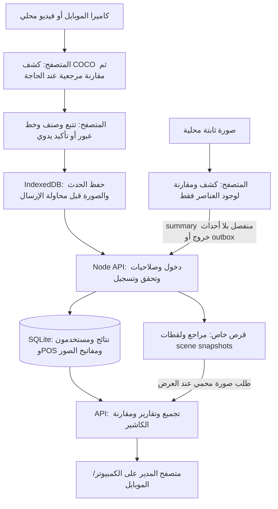
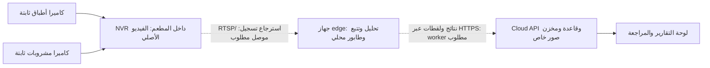

# IEP Vision — المراجعة الشاملة وحالة المشروع

**تاريخ المراجعة:** 2026-10-09 UTC. **إصدار التطبيق:** 0.3.0. **المصدر المراجع:** `ecbcb662a8be4a1df9d46e10274e8c26d4f57591`، فرع `iep-pilot`.

هذه مراجعة للكود والاختبارات والواجهة والتخزين والعمليات المطلوبة في المطعم. التحديث الحالي يغيّر الوثائق وأدلة المراجعة؛ العيوب المفتوحة أدناه لم تُصلح في كود التطبيق بهذه المراجعة. لا توجد بيانات مطعم حقيقية أو مواصفات NVR أو كاشير مقدمة للتحقق الميداني.

## 1. قرار الجاهزية

**النسخة تصلح لتجارب وظيفية قصيرة على الكمبيوتر ولفحص طريقة العمل. لا تُعتمد حاليًا للعد الآلي النهائي أو لحساب خسائر المطعم دون مراجعة بشرية.**

توجد واجهة عربية، كتالوج، تجربة فيديو وصورة، عد عبور تجريبي، تقارير، مقارنة كاشير، خمسة أدوار، إدارة مخاطر، API ، وتخزين صور مستقل مع نسخ واستعادة. نجحت الاختبارات القائمة، وكشفت probes إضافية عيوبًا غير مغطاة فيها: ازدواج هوية عبور معروف/مجهول، تصادم معرفات التجارب، إعداد تخزين قد يكشف ملفات، وتغيّر سياق تشغيل الكاميرا. معالجة الرؤية الحالية أبطأ من المهلة اللازمة لاستمرار التتبع في بعض المسارات المقاسة.

لا يوجد رابط HTTPS عام، موصل Hikvision/RTSP/ONVIF أو خدمة edge مستقلة، تدريب كاشف مطعم مخصص، دقة معتمدة، تحقق Android فعلي، أو تشغيل متواصل لوردية/24 ساعة. النشر السحابي وحجم السيرفر وحدهما لا يكملان هذه الأجزاء.

## 2. الهدف التشغيلي وتعريف العدد

IEP ستقدم النظام لعدة مطاعم. التركيب المستهدف نقطة خروج أطباق بعرض لا يتجاوز مترًا، حتى أربعة عناصر في الوقت نفسه، ونقطة مشروبات مشابهة. هذه قيود جيدة لتصميم زاوية ثابتة ومنطقة اهتمام وخط عبور مستقل لكل نقطة.

وحدة القياس المقترحة هي **عنصر خرج فعليًا عبر نقطة الخدمة باتجاه محدد**، لا عدد الطلبات أو الأصناف التي ظهرت في إطار. يرجع تعريف العودة ثم الخروج، إعادة تقديم نفس الطبق، الصواني والكومبو وإعادة التحضير إلى سياسة تشغيل مكتوبة. تتبع الصندوق الحالي لا يثبت هوية الطبق بعد اختفاء طويل، ولا يربط كل مرور برقم طلب.

للتجربة بالموبايل المتحرك يوجد تعرف مقترح وتأكيد يدوي. العد الآلي بالعبور يحتاج كاميرا ثابتة. الصورة الثابتة تعطي وجود عناصر فقط، ولا تثبت خروجها. الفارق مع الكاشير إشارة مراجعة، ولا يحدد سرقة أو شخصًا مسؤولًا عنها.

## 3. أين يرى ويفهم ويسجل ويحلل؟

### المسار المنفذ الآن



التحليل داخل جهاز المتصفح، وليس داخل عملية Node. ملفات النماذج تُحمّل من الخادم محليًا. زيادة CPU أو إضافة GPU لخادم الموقع لا تسرع تلقائيًا inference الذي يعمل على الهاتف.

### التركيب النهائي المقترح — أجزاء تحتاج تنفيذًا



لا نكرر حفظ فيديو يوم كامل على السحابة افتراضيًا. RTSP لا يفتح مباشرة في Android Chrome ؛ يحتاج بوابة/عامل معالجة. API جاهز لاستقبال أحداث مصدر مستقبلي، لكنه ليس موصل NVR منفذًا. إدارة كاميرتين مستقلة و ROI ومعايرة وتوقيت وبداية تلقائية وتحديث النموذج تحتاج خدمة وتركيبًا ميدانيًا.

## 4. مصفوفة الوظائف وحالتها

| الوظيفة | الحالة الفعلية | الدليل أو الحد |
|---|---|---|
| واجهة عربية للموبايل والكمبيوتر | منفذة، واختبارات Chromium ناجحة | [index.html](../public/index.html)، Android فعلي ورابط عام غير مختبرين |
| تعريف مطاعم وعناصر | منفذ | [catalog](../server/catalog.mjs)، أنواع dish/drink/object/person |
| صور متعددة لأشكال تقديم الصنف | منفذ كمقارنة مرجعية | نفس dishId ، variantLabel ، ليست تدريب كاشف جديد |
| 80 فئة عامة باختيار صريح | منفذ ضمن vocabulary COCO | [الفئات](../server/recognition-classes.mjs)، لا تشمل plate ولا كل الأشياء |
| فيديو محلي على أجزاء | منفذ | خطوة 0.2 ثانية من زمن الفيديو، الفيديو يبقى عند المستخدم |
| صورة ثابتة | تحليل وحفظ ملخص منفذان | إعادة عرض الملخص من سجل التجارب ناقصة: REV-06 |
| عد تلقائي بكاميرا ثابتة | تجريبي | 3 ملاحظات مستقرة وخط واتجاه؛ قياس الدقة الحقيقي غائب |
| موبايل متحرك | تأكيد يدوي | لا عد تلقائي موثوق من حركة الكاميرا |
| أربعة عناصر معًا | مسار متعدد الصناديق مختبر اصطناعيًا | فيديو مطعم بأربعة أطباق/صينية/أيدٍ غير مختبر |
| مجهول ومراجعة وتصحيح | منفذ | لا يسجل ما لم يُكشف أصلًا؛ REV-01 يحتاج إصلاحًا |
| تقارير تاريخية و CSV | منفذ | totals للفترة وصفحات أحداث؛ CSV يجمع الأصناف |
| مقارنة POS يدوي/CSV/API | منفذة كمجاميع يومية | لا موصل مورد أو ربط كل طبق بطلب |
| أدوار ومطاعم ومفاتيح محدودة | منفذة وتحقق server-side | فصل العملاء والمطاعم والمفاتيح مختبر |
| إدارة مخاطر واعتماد يومية | منفذة | اعتماد مدير مع إقرار تغطية ناقصة؛ ليس إثبات دقة |
| صور مستقلة عن SQLite | منفذة على filesystem خاص | S3/MinIO adapter غير منفذ؛ REV-03/08/09 |
| نسخة DB+media والتحقق والاستعادة | منفذة ومختبرة ببيانات مؤقتة | لا جدول خارجي أو RPO/RTO معتمد؛ REV-08/14 |
| متابعة فجوات وتجمد/انقطاع رفع | جزئية | النبضات لا تثبت دقة العد، ولا تسترجع فيديو غائبًا |
| Hikvision/NVR/ONVIF/RTSP | غير منفذ | موديل وبروتوكول وصلاحيات التسجيل تحتاج اختيارًا وتجربة |
| بداية تلقائية، UPS ، backfill ، إنذار خارجي | غير منفذة كحل إنتاج | طابور المتصفح لا يغطي توقف التصوير أو إغلاقه |
| عدة عملاء تجاريًا | عزل tenants تجريبي | لا فوترة أو حصص أو لوحة IEP مركزية أو توسع PostgreSQL |

## 5. العيوب المفتوحة المثبتة وأولوياتها

**P1:** معالجة قبل نشر ببيانات حساسة أو اعتماد الأعداد. **P2:** معالجة قبل تشغيل تجاري أو اعتماد مراجعات طويلة. **P3:** تحسين أو توضيح لا يحول وحده النسخة إلى إنتاج. الأولوية حكم تنفيذ، وليست احتمالًا إحصائيًا مقاسًا. الدليل إما probe فعلي أو مسار كود واضح، ومميز أدناه.

| ID | الأولوية | المشكلة والأثر | الدليل | الإصلاح المطلوب واختبار القبول |
|---|---|---|---|---|
| REV-01 | P1 | known و unknown يحتفظان بنفس tuple في جدولين؛ confirm يضيف عدًا ثانيًا | probe API: مجموع 2 لنفس session/track/crossing ؛ [index:90](../server/index.mjs#L90)، [governance:33](../server/governance.mjs#L33)، [resolve:35](../server/governance.mjs#L35) | هوية عبور موحدة وحالة unresolved/confirmed ؛ إعادة النوع أو confirm لا يزيد العدد عن 1 |
| REV-02 | P1 | live session نصه experiment:ID:... يتصادم مع prefix تجربة، فتفقد التجربة الحدث ك duplicate | probe: experiment inserted0/duplicates1/total0 ؛ [index:89](../server/index.mjs#L89) | namespace مستقل في مفتاح DB أو encoding غير قابل للتصادم، مع فصل live/experiment/review صراحة |
| REV-03 | P1 مشروط بالإعداد | dataDir داخل public أو media symlink إليه يجعل DB/صورًا قابلة للتحميل دون دخول | نسخة app مؤقتة: GET200 وتوقيع SQLite ؛ [index:19](../server/index.mjs#L19)، [static:96](../server/index.mjs#L96) | رفض realpath/ancestors غير الآمنة لكلا المسارين ولخدمة static ، واختبارات إعداد سلبية |
| REV-04 | P2 | إذن كاميرا متأخر يستكمل بعد تغيير المطعم؛ التصوير والمراقبة يبدأان لسياق جديد دون Start جديد | probe Chromium: كانت متوقفة ثم تعمل و monitor نشط للمطعم 2 ؛ [app:53](../public/app.js#L53)، [switch:24](../public/app.js#L24) | تثبيت generation والمطعم من click حتى كل await ، وإيقاف tracks القديمة فور وصولها |
| REV-05 | مانع قبول حي | cadence المقاس أكبر من 1.5s ، فينتهي track قبل استقرار 3 ملاحظات | benchmark حقيقي + probe tracker ، [tracker:7](../public/tracker.js#L7)، [expiry:27](../public/tracker.js#L27)، [live:63](../public/app.js#L63) | runtime/model أسرع وقياس فعلي؛ تغيير timeout وحده لا يعيد عبورًا لم يُشاهد |
| REV-06 | P2 | فتح تجربة صورة محفوظة يعرض 0 أحداث ولا يعرض summary الأصناف الموجود | مسار كود: [photo:4](../public/photo-analysis.js#L4)، [history:17](../public/workflows.js#L17) | عرض summary عندما source=still-image وتحديث التاريخ بعد الحفظ؛ reload ثم فتح الملخص |
| REV-07 | P2 | حفظ الإعدادات أثناء الفيديو يغير threshold/الرسم/اللقطات مع بقاء tracker و provenance بإعدادات البداية | قراءة مسار ثابت: [settings:48](../public/app.js#L48)، [experiment:11](../public/workflows.js#L11)، [processing:15](../public/workflows.js#L15) | إيقاف التشغيل عند التعديل أو freeze config كامل لكل تجربة؛ السجل يطابق ما استُخدم فعلًا |
| REV-08 | P2 | استعادة ملف صحيح بحالة pending تبقي المرجع مستبعدًا رغم complete backup | probe: complete=true و catalog pending و GET200 يصلحه؛ [media:30](../server/media-store.mjs#L30)، [restore:10](../scripts/backup-data.mjs#L10)، [references:51](../public/app.js#L51) | تحقق ملف موجود ثم heal state ، أو normalize verified images بالاستعادة؛ المرجع يعمل بعد restart دون GET يدوي |
| REV-09 | P2 | تحديث media status يمسح تاريخ 3 جداول بلا image_key indexes ، ويكتب ready عند كل GET ناجح | EXPLAIN: SCAN events على مليون صف؛ [media:12](../server/media-store.mjs#L12)، [mark:20](../server/media-store.mjs#L20) | فهارس ترحيل آمنة وتقليل تحديثات الحالة المتكررة؛ planner indexed lookup واختبار حمل صور |
| REV-10 | P2 | إضافة وحذف مراجع بلا audit ، ومراجع التجربة IDs فقط؛ تتبع تغيير النموذج التشغيلي غير مكتمل | probe audit بقي 1 بعد upload/delete ؛ [index:82](../server/index.mjs#L82)، [delete:85](../server/index.mjs#L85)، [provenance:11](../public/workflows.js#L11) | سجل actor/key/hash لكل تغيير ونسخة مراجع/كتالوج ثابتة لكل تشغيل؛ provenance للصورة أيضًا |
| REV-11 | P2 | occurredAt:null مقبول، ويحفظ 1970 ويخرج من يوم التشغيل الصحيح | probe known/unknown200 ؛ [index:89](../server/index.mjs#L89)، [unknown:33](../server/governance.mjs#L33) | ISO string مع timezone صريحة، وفحص objects/arrays قبل القراءة؛ null/invalid يرجع 400 |
| REV-12 | P2 | duplicate بنفس الهوية وصنف/وقت/mode مختلف يعاد 200 بصمت بدل conflict | probe200duplicates1 مع حفظ الأصل؛ [index:90](../server/index.mjs#L90) | قارن payload الأصلي/بصمته؛ غير المطابق 409 ، الصورة تصلح بإعادة الأصل فقط |
| REV-13 | P2 | DB permissions تعتمد umask ؛ 022 ينتج dataDir755 و SQLite644 | probe مؤقت؛ [index:20](../server/index.mjs#L20)، [Dockerfile](../Dockerfile) | أذونات صريحة للبيانات و WAL/SHM/النسخ، مستخدم OS/container محدود وأذونات volumes صحيحة |
| REV-14 | P2 للسعة | backup/verify يحمل DB كاملًا في RAM ويبحث refs لكل صورة تربيعيًا | تحليل كود، لا فشل multi-GB مقاس؛ [backup:8](../scripts/backup-data.mjs#L8)، [verify:9](../scripts/backup-data.mjs#L9) | hashing على دفعات و Map/index وتعداد bounded ؛ قياس مدة وذاكرة نسخة كبيرة |
| REV-15 | P2 للتاريخ | مجهول أحدث 200 فقط؛ monitor أحدث 1000 قبل فلترة اليوم؛ التجارب تحمل كل summaries | [unknown:32](../server/governance.mjs#L32)، [operations:17](../server/operations.mjs#L17)، [experiments:20](../server/operations.mjs#L20) | cursor/day filters لكل التاريخ، و query فترة المتابعة قبل limit ؛ مدير يصل لكل حالات يوم قديم |
| REV-16 | P2 للنشر | الدخول خلف proxy واحد يشترك في 10 محاولات/دقيقة بحسب socket IP | probe11 عنوان XFF مختلفًا: الطلب 11=429 ؛ [login:56](../server/index.mjs#L56) | trusted proxy مضبوط أو limits عند edge مع حد للحساب؛ لا ثقة عمياء بـ XFF |

### حدود النتائج وإعادة إنتاج أهم الحالات

- **REV-01:** أرسل `/api/events` لصنف معلوم، ثم `/api/unknown-events` بنفس sessionId/trackId/crossingId والتوقيت، ثم confirm للمجهول. خرجت التقارير بعدد 2. المنع الحالي يمنع تكرار نفس الجدول، وليس انتقال الهوية بين الجدولين.
- **REV-02:** أنشئ experiment ID ، ثم حدث live باسم session `experiment:<ID>:reserved`. أرسل حدث تجربة بنفس track/crossing و session=`reserved`. عاد duplicate مع غياب حدث التجربة؛ يحدث بسبب تركيب namespace نصي.
- **REV-03:** جرّب في نسخة معزولة dataDir تحت public ، ثم mediaDir خارجي symlink إلى public. GET raw file دون Cookie أعاد 200. يحتاج تحكمًا بإعداد OS/مسار التخزين؛ ليس تجاوزًا متاحًا لمستخدم API عادي في الإعداد الافتراضي الصحيح، ولم تُكشف بيانات حقيقية.
- **REV-04:** أخّر promise إذن الكاميرا، غيّر المطعم، ثم أكمل الإذن. استُخدمت كاميرا وهمية وكاشف اصطناعي لاختبار lifecycle فقط؛ لا دقة أو Android فعلي.
- **REV-05:** مررت أربع مشاهدات متتابعة لصندوق عنصر واحد معلوم عبر الخط. بفاصل 200ms: track واحد وعد 1. بفاصل 1868ms أو 5211ms: IDs1/2/3/4 وعد 0. الأوقات محاكاة cadence المقاس؛ ليس فيديو مطعم.

### ملاحظات إضافية تستلزم سياسة أو تحسينًا

1. تأكيد مجهول لصنف مؤرشف بعد وقت الأرشفة ينجح، بينما event مباشر بالتوقيت نفسه يرفض 409. يلزم توحيد سياسة التاريخ والقرار الإداري بين المسارين، مع إبقاء تعديل التاريخ المصرح ممكنًا.
2. rename لصنف يغير اسم أحداثه القديمة المعروض لأن التقرير يستخدم الاسم الحالي؛ POS revisions تحتفظ بأسمائها. إذا مطلوب الاسم وقت الخروج، أضف snapshot/version ولا تفترض أنه محفوظ الآن.
3. summary الصور والفيديو يجمع بالأسماء، فيدمج صنفين متساويي الاسم؛ object عادي يتأثر بأسماء مثل constructor. الإجمالي التشغيلي الأصلي مبني على IDs ، لكن الملخص يحتاج Map بالمُعرّف.
4. GET catalog لا يعيد warnings للتعارض بعد reload ؛ resolver يظل آمنًا ويعيد ambiguous. احتفظ بتحذير يمكن مراجعته من المكتبة بعد إعادة الدخول.
5. الطابور يعيد أخطاء 4xx الدائمة دون dead-letter/حل واضح. المدخل غير القابل للإرسال يحتل السعة؛ يلزم مسار مراجعة يحافظ على الأصل وأسبابه دون إسقاط صامت.
6. إعدادات ومصدر الكاميرا في localStorage على مستوى المتصفح، وليست سجل مصادر لكل مطعم؛ تبويبان قد يستخدمان sourceId نفسه ويغلق بدء أحدهما متابعة الآخر. يلزم registry ومعايرة وهوية مستقلة لكل كاميرا.
7. summary التجربة محدود 10000 حرف، لكن provenance يسرد المراجع كلها؛ كتالوج كبير قد يفشل حفظها. لم يُقَس حد كتالوج مطعم حقيقي؛ نسخة model/catalog المرجعية أفضل من payload متزايد.
8. `parseImage` يتحقق من magic bytes والحجم، لا decodability أو أبعاد الصورة. SHA256 يثبت ثبات البايتات لا صحة الصورة؛ بعض probes استعملت PNG header8bytes ، واختبارات المتصفح تستعمل صورًا قابلة للقراءة.
9. Dockerfile موجود ولم يُختبر build/runtime هنا؛ لا USER محدود ولا image digest ثابت. إعداد restart/HTTPS/health/volume ownership يحتاج تجربة استضافة مستقلة.
10. تغيّر body/time/صور غير صالح يحتاج 400 موحدًا بدل أخطاء 500 غير متوقعة. عقد OpenAPI بلا response schemas كاملة، و monitor/start يلزم camera/sourceId في schema رغم defaults التنفيذ؛ لا نصفه SDK معتمدًا.

## 6. التعرف: الطبق، وصفته، وتنوع التقديم

المسار الحالي مرحلتان: COCO يقترح صناديق بفئة عامة، ثم MobileNet embeddings تقارن بصور المطعم حين recognitionMode=reference. generic detector mode يربط فئة موجودة بعنصر اختاره المدير دون تمييز وصفة. [recognition.js](../public/recognition.js) يجمع أفضل تشابه لكل صنف، ويطبق threshold ومقدار فصل عن البديل؛ التعارض العام لا يختار صنفًا عشوائيًا.

**لا توجد فئة plate عامة ضمن COCO80.** bowl وبعض foods و cup موجودة؛ طبق مسطح أو طعام خارج vocabulary قد لا يُكشف. إضافة صور بشاميل أو 6 أشكال تقديم لا تعيد تدريب مرحلة الكشف، ولا تضمن أن الكاشف سيقترح صندوقًا لها. لو العنصر لم يُكشف أصلًا فلن ينتج سجل مجهول. ذلك يختلف عن عنصر اكتُشف لكن صنفه ملتبس.

خطة التحسين: بيانات من زاوية كل شباك، تعريف detection classes مناسبة للطبق/الكوب، تقييم كاشف مطعم، ثم تصنيف الوصفة. أصناف متطابقة بصريًا وأكواب مغلقة تحتاج علامة/تغليف/ربط طلب أو إعادة تصميم المشهد. الصور المرجعية لكل صنف تغطي الشكل والزاوية والإضاءة والتقديم، مع فصل صور الضبط عن فيديو التقييم المستقل. النسبة المعروضة detector score أو cosine similarity حسب المسار، وليست احتمال صحة معايرًا أو نسبة دقة مطعم.

لا توجد هوية شخصية أو تعرف وجوه. إضافة person تعني كشف/عد فئة عامة، وتبقى خارج توقعات POS الجديدة. generic label bottle لا يحدد محتوى الزجاجة أو سعرها.

## 7. البيانات والصور والخصوصية والنسخ

| ما يُحفظ | المكان | الملاحظات |
|---|---|---|
| فيديو أصلي للتركيب النهائي | NVR | خارج التطبيق؛ الاحتفاظ والاسترجاع حسب الجهاز والسياسة |
| ملف فيديو تجربة | جهاز المستخدم | لا يُرفع كاملًا؛ احتفظ بالأصل لإعادة الفحص |
| الأصناف/الأحداث/الوقت/الكاميرا/الثقة/المراجعات | SQLite في IEP_DATA_DIR | metadata ، مفاتيح صورة وحالة، indexes والتاريخ |
| مراجع ولقطات known/unknown | filesystem خاص في IEP_MEDIA_DIR | default dataDir/media ، ويمكن volume مستقل؛ ليس S3 |
| بيانات غير مرسلة وصورتها | IndexedDB في جهاز المتصفح | تحت origin والمستخدم؛ ليست backup أو تشفيرًا مضمونًا |
| DB+media backup | وجهة جديدة تختارها الإدارة | snapshot+manifest ، لا رفع خارجي/جدولة تلقائية |

صور الأحداث الحالية **لقطة للمشهد بعرض أقصى480px ، وليست crop للطبق وحده**؛ قد تتضمن أكثر من عنصر وأيدي أو أشخاصًا. حفظ snapshots مفعّل افتراضيًا في UI ويمكن إيقافه. للعميل سياسة ظهور واحتفاظ وصلاحية وعرض، وعند الحاجة crop/masking وتصغير ROI ؛ لا نفترض موافقة موظفين أو سياسة قانونية محددة غير مقدمة.

GET صور عادي يمر بالجلسة/المفتاح والمطعم والصلاحية، مع checksum عند القراءة. reports/catalog تحمل metadata ولا تحمل BLOB جديدًا. ready/pending/missing/corrupt/legacy/none حالات distinct ؛ file missing لا يعني إلغاء عد الحدث. disk write failure يبقي metadata ، ويحتفظ sender بالصورة لإعادتها بنفس المفاتيح. بعد وصول metadata وفشل الصورة لا تزِد العدد عند repair.

ترحيل BLOB يأخذ نسخة SQLite أولًا وينقل الصورة ويتحقق قبل تفريغ الأصل؛ الفشل يترك BLOB. SQLite قد لا ينكمش فيزيائيًا بعد النقل؛ offline VACUUM يحتاج صيانة ونسخة ومساحة. تعثر migration متكرر قد يضيف نسخ pre-media جديدة؛ ضع مراقبة وسياسة تنظيف آمنة.

النسخ المنفذ: online SQLite snapshot ثم صور المفاتيح المشار إليها وبصمات، والتحقق والاستعادة إلى مسارات جديدة. نقص/تلف صورة يجعل النسخة incomplete ؛ تُرفض الاستعادة افتراضيًا. `--allow-incomplete` طوارئ صريحة. النسخة المتسقة ليست خطة disaster recovery كاملة: راجع REV-08/14 ، واختبر volumes الإنتاج وصور المجهول والمراجع والعد والصلاحيات، وحدد RPO/RTO ومسؤولًا وتخزينًا خارج الجهاز وتشفيرًا واحتفاظًا.

```sh
npm run backup -- --output /backup/iep-NEW
npm run backup -- --verify /backup/iep-NEW
# الخدمة متوقفة عند تبديل المسارات؛ الوجهتان جديدتان وغير موجودتين.
npm run backup -- --restore /backup/iep-NEW --data-dir /restore/data --media-dir /restore/media
```

DB و filesystem ليسا transaction ذريًا واحدًا؛ crash قد يترك ملفًا غير مرجوع إليه أو metadata pending. الحذف المرجعي لا ينظف الملفات تلقائيًا؛ لا garbage collector/retention/quota شامل. الأداة لا تضمن power-loss durability بمجرد اختبارات وظائف، وال manifest يثبت سلامة مصدر موثوق لا يمنع مهاجمًا قادرًا على تبديل النسخة وال manifest معًا.

## 8. يوم كامل من الفيديو وحجم طويل المدى

تجربة الفيديو تفحص زمن المصدر بالتتابع كل 0.2s ، وتتوقف/تستكمل داخل الصفحة؛ مصدر الساعة هو mediaTimeSec وليس تاريخ التصوير الأصلي. occurredAt للتجربة مبني على وقت تشغيلها مع موضعها؛ لا يصلح لاعتباره تاريخ خروج أصلي من NVR. الفيديو المحلي قد ينتهي مع ملخص مكتمل بينما بعض أحداثه لا تزال في queue ؛ راجع محفوظ server records بعد الإرسال.

**قياس جديد على 0.3.0:** [JSON الكامل](review-evidence/capacity-2026-10-09.json). AMD EPYC ، حصة cgroup4CPU و 32GiB ، Node24.19.0 ؛ خمس عينات بعد الإحماء لكل عملية. Chromium WebGL هو SwiftShader برمجي، وليس GPU فعليًا. بيئة مشتركة، لا isolated performance lab أو SLA.

| القياس | النتيجة الحالية | حد الاستنتاج |
|---|---|---|
|100 ألف حدث بدون صور | SQLite16.20MB ؛ reconciliation6.73ms ؛ report10.48ms | localhost ، يوم 5000 حدث، 20 صنف |
|مليون حدث بدون صور | SQLite162.48MB ؛ reconciliation4.95ms ؛ report8.25ms | metadata فقط، آخر 1000 حدث في الرد مع totals كاملة |
|كشف +4 قصاصات CPU ، 640×360 | متوسط 4.8606s للإطار | أربع قصاصات مفروضة، لا accuracy حقيقية |
|كشف +4 قصاصات WebGL SwiftShader | متوسط 1.51812s | برمجي، لا T4 أو GPU المطعم |
|كاشف فقط | CPU1.78392s ؛ software WebGL0.54992s | لا يمثل pipeline عام كامل مع tracking/IO |

هذا benchmark لم يرفع مليون طلب/صورة، ولم يقس تزامن عدة عملاء أو فك فيديو يوم كامل أو thermals. حال الصور لها مسار SQL مختلف يعاني REV-09 ؛ سرعة metadata لا تثبت سرعة الصور أو النسخ. الأرقام القديمة 160.6MB/4.21ms/6.73ms في الوثائق الفرعية وواجهة /api/capacity قيم baseline محفوظة من تشغيل سابق، وليست قراءة أداء ديناميكية أو القياس الجديد.

استقراء 24h فيديو عند 5fps:432000 إطار لكل كاميرا. بالمتوسط المقاس ≈583 ساعة CPU أو 182 ساعة software WebGL لمسار الأربع قصاصات، قبل decode/seek وباقي العمل. **هذه معادلة استقراء وليست تشغيلًا فعليًا لتلك المدة.** الفيديو المسجل يستخدم media timestamps لذلك يمكن أن يحتفظ بالتتبع رغم بطء الساعة الحقيقية؛ live loop يستخدم وقت الالتقاط ويضيف 350ms ، فتتجاوز الفترة مهلة 1.5s في المسارات المقاسة. generic path يتجنب embeddings لكل عنصر، لكن لا يوجد acceptance live جديد لهذه الفئات.

افتراض تخطيط للمساحة:5000 snapshot يوميًا ×80KB ≈400MB/يوم، 12GB/30 يوم، 36GB/90 يوم، 146GB/365 يوم قبل مراجع ومجهول و metadata ونسخ وهامش. الاحتفاظ بنسختين كاملتين يزيد raw الصور إلى نحو 3 أضعاف مع الأصل. المتوسط 80KB افتراض، ويقاس بعد اختيار ROI وجودة JPEG والخصوصية؛ base64 يزيد حجم النقل قبل HTTP overhead.

كاميرتان ×2Mbps ×24h≈43.2GB/يوم أو 1.296TB/30 يوم. هذه ميزانية فيديو NVR أو نقل لو اخترنا cloud inference ؛ ليست مساحة التطبيق الذي يحفظ النتائج واللقطات. عداد يوم 5000 حدث لا يعني 5000 طلب HTTP أو 5fps فقط؛ تتبع اليوم يحتاج قراءة الإطارات حتى بين الأحداث.

## 9. السيرفر والنشر والكلفة

| الاستخدام | نقطة بدء مقترحة | ما يلزم قبل اعتمادها |
|---|---|---|
|Cloud API وتقارير لمطعم تجريبي |2vCPU/4GB RAM ، 40–80GB SSD دائم إضافة لمخزن الصور والنسخ، HTTPS | load test لرفع الصور/المراجعة/النسخ، إصلاح P1 ومسارات البيانات، replica واحدة SQLite |
|عدة عملاء في بداية التشغيل |4vCPU/8GB كنقطة قياس | تزامن ingestion/reports وحدود العملاء؛ ليس SLA أو ضمان عدد المطاعم |
|Edge داخل المطعم |جهاز مرشح يقاس بكاميرتين والنموذج الفعلي | لا مواصفة شراء نهائية قبل throughput والدقة والحرارة والعودة من الكهرباء |
|Cloud inference مستقل |4–8vCPU/16–32GB RAM و GPU16GB مثل T4 كمرشح تجربة | gateway/VPN و worker optimized وقياس؛ CUDA/RTSP غير منفذين |

SQLite الحالي خدمة واحدة على قرص محلي؛ لا replicas تشارك DB عبر شبكة. PostgreSQL و S3 مساران مستقبليان، لا إعدادان مفعلان. Docker يحدد/data و/media ك volumes منفصلة، لكنه لا يدير named volumes أو backup أو HTTPS بذاته. إن كانا على قرص واحد ففشل القرص يؤثر على الاثنين.

المستهدف المبدئي لكاميرتين 5fps هو 10 إطارات مركبة/ثانية؛ عامل متسلسل يحتاج متوسطًا أقل من 100ms قبل باقي التكاليف وهامش الذروة. الهدف يحتاج قبول الدقة عند ذلك المعدل؛ ليس رقمًا محققًا أو ضمانًا مناسبًا لكل سرعة خروج.

التوصية: NVR للفيديو، inference محلي دائم، cloud للنتائج والصور المختارة والتقارير. cloud inference ينقل نحو 4Mbps uplink مستمر لكاميرتين 2Mbps قبل overhead ، وقد يصل 1.296TB شهريًا 24h. لا تُفتح منافذ NVR للإنترنت؛ بوابة outbound/VPN موثوقة وصلاحيات stream محدودة. التكلفة CPU/GPU وساعات تشغيل وتخزين ونسخ و egress ونطاق/VPN وإدارة؛ لا عروض أسعار حية أو مزود اختير لهذه المراجعة.

## 10. تشغيل المطعم والكاشير والمراجعة اليومية

المعادلة المنفذة: **المتوقع خروجُه = sold − cancelled + complimentary + waste**. sold إجمالي وحدات قبل الإلغاء، cancelled ما أُلغي قبل الخروج، والمجاني/الهالك وحدات إضافية عبرت الشباك ولم تدخل sold. استرداد بعد خروج فعلي لا يخفض الواقع، وهالك بقي بالمطبخ لا يضاف لعداد منفذ الخدمة. حدد مكونات الكومبو ووحدة الصنف وإعادة التحضير ومشروبات التعبئة قبل الربط.

الفارق=observed−expectedOut ؛ manual و automatic منفصلان. التجارب و unknown غير المؤكد خارج العدد التشغيلي. people/object خارج POS الجديدة، مع حفظ قراءة مراجعات تاريخية سبق أن تضمنت صنفًا تغير نوعه.

POS snapshot كامل ليوم واحد، revision ثابت مع payload hash ؛ نفس الإصدار آمن، المختلف بنفس الإصدار 409 ، replay القديم لا يجعله current. يوم Africa/Cairo تقويمي مع حدود DST23/25 ساعة. بداية وردية 4 صباحًا أو split shifts ليست إعدادًا منفذًا؛ تحتاج تعريف يوم متفقًا عليه في POS والكاميرا والتقارير.

اعتماد المدير مرتبط بأحدث POS revision وبسبب وإقرار incomplete coverage ، ويقفل تعديل POS حتى reopening. أحداث متأخرة أو مجهول أو تصحيح تعيد needs_review. لا يلزم حسم كل الاستثناءات أو توقيع شخصين منفصلين قبل الموافقة؛ اتفق على السياسة المالية. مطابقة يومية مجمعة لا تربط كل طبق بفاتورة، ولا تكشف فقد خامات أو مبيعات خارج نقطة التصوير.

## 11. الأدوار والأمن

| الدور | ما يسمح به في النطاق | ما لا تمنحه النسخة افتراضيًا |
|---|---|---|
|Owner |مطاعم وحسابات العميل، التشغيل، POS ،مراجعة ومفاتيح |لوحة تجارية مركزية لكل عملاء IEP غير منفذة |
|Manager |كتالوج/تشغيل/POS/مراجعة ومستخدمون أدنى ضمن المطاعم المعينة |تعديل owner أو peer manager أو مطاعم غير معينة |
|Daily operator |إدخال POS وتأكيد يدوي وقراءة تقارير ومخاطر |اعتماد اليوم، أحداث automatic ، إدارة حسابات ومفاتيح |
|Engineer |كتالوج وتجارب/automatic events ومصادر ومفاتيح حسب صلاحياته |POS أو اعتماد اليوم أو تزويد المفتاح بصلاحية لا يملكها |
|Viewer |قراءة الكتالوج والتقارير والمراقبة والمخاطر |تعديل أو تشغيل تجربة أو POS |

الدليل [access.mjs](../server/access.mjs). تحقق API يتبع المطعم الحقيقي للمورد، لا query مزيفًا؛ الاختبارات أكدت ذلك. مفاتيح محددة بالنطاق/المطعم/المدة، raw token يظهر مرة واحدة؛ hash مخزن، ويمكن revoke. تعديل الدور/العضوية أو تعطيل الحساب يبطل sessions/keys القديمة.

Passwords scrypt مع salt ، sessions HttpOnly/SameSite ، Secure عند HTTPS وإعداد IEP_SECURE_COOKIE ، origin check ، prepared SQL ، حدود جسم HTTP وصور. وجودها ليس security certification. التطبيق لا يشفر القرص تلقائيًا ولا يثبت مصدر الحدث الفيزيائي؛ engineer مخول يستطيع إرسال حدث automatic عبر API. audit داخل SQLite قابل لتغيير مسؤول OS ، ومع REV-10 لا يغطي كل تغيير مرجعي.

MFA ، reset/password rotation UI ، فصل إدخال واعتماد إلزامي، سجل خارجي موثوق، حصص و retention وتشفير backups وسياسة access للصور تحتاج تجهيزًا. IndexedDB يحتفظ بالصور والبيانات المعلقة بعد logout لأجل التسليم؛ سلامة جهاز التشغيل مطلوبة.

`npm audit --omit=dev`: exit1 ، 3 entries بمستوى moderate عبر سلسلة واحدة `@tensorflow/tfjs → argparse → sprintf-js1.0.3`، advisory [GHSA-hp3w-g68c-fv3c](https://github.com/advisories/GHSA-hp3w-g68c-fv3c)، ولا automatic fix. يتعلق DoS عبر precision specifiers ؛ لم يُثبت مسار استغلال HTTP في التطبيق، ولا نصف 3packages كثلاث ثغرات مستقلة. يلزم فحص reachability وتحديث/استبدال آمن مع اختبار النماذج، دون npm audit fix عشوائي أو إلغاء TLS.

## 12. الانقطاعات والتعافي

| الحالة | الموجود الآن | المطلوب أو حد التغطية |
|---|---|---|
|انقطاع الإنترنت مع استمرار الصفحة |queue محلي ثم retry مع نفس IDs |حد 1000 سجل/64MiB تقديري JSON ؛ فحص متصفح فعلي و dead-letter |
|تعذر كتابة صورة |metadata وعد محفوظان، mediaPending وإعادة الصورة |REV-08/09 ؛ لا acknowledge للصورة قبل ready |
|ملف مفقود/تالف |حالة واضحة و checksum عند GET |إعادة الأصل/backup ؛ لا invent لصورة بديلة |
|إغلاق متصفح أو محو تخزينه |قد تبقى IndexedDB أو تُفقد |لا تصوير/معالجة بالخلفية مضمونين، وليست queue صناعية |
|توقف إطارات/نبضات |stalled أو فجوات unknown ، نبضة UI كل10s، وتوصية API كل15s، وstale بعد45s |التوقيت window وليس تشخيص سبب الكهرباء؛ لا إنذار SMS/email |
|حركة مشهد توقف العد |tracker يمسح side/pending مؤقتًا |heartbeat قد يظل running ؛ availability لا يثبت صلاحية العد |
|قطع كهرباء |لا معالجة أثناء التوقف |UPS للكمرات/PoE/NVR/edge/router ، بدء تلقائي، اختبار durability |
|NVR سجل فترة انقطاع التحليل |الفيديو ممكن نظريًا للمراجعة |backfill غير منفذ؛ يحتاج مصدر وقت وتداخل وهوية تمنع التكرار |
|غياب تسجيل أصلًا |لا دليل تصوير |لا يمكن استعادة خروج لم يُصوّر أو افتراضه صفرًا |

تغطية اليوم complete=false صراحة؛ النبضة أو GET/health تثبت خدمة/اتصالًا لا دقة وعدًا كاملين. حالة completed في تجربة تشير انتهاء المرور على الجزء، ولا تعني قبول نتائج المطعم أو اكتمال إرسال كل pending image.

## 13. مرجع API والتكامل

الواجهة تعرض المسارات والمفاتيح وفحص GET و OpenAPI. [الدليل](INTEGRATION_GUIDE.md)، [العقد](../server/API.md)، [OpenAPI](openapi.json). Cookie للواجهة و Bearer محدود لموصل خادمي. لا مفتاح داخل frontend عام ولا أسرار NVR في JavaScript. العزل ومفاتيح expiry/revoke مختبرة.

| مجموعة المسارات | الغرض | حد مهم |
|---|---|---|
|restaurants/dishes/recognition/classes/samples |الكتالوج والمرجع والفئات |صورة مرجع≤2MiB ؛ variantLabel≤100 ؛ archive يحفظ ID |
|events/unknown-events |نتائج مؤكدة/غير مؤكدة |200known أو 100unknown/دفعة؛صورة≤512KiB وجسم≤3MiB ؛ REV-01/02/11/12 |
|reports/reports.csv |totals وأحداث وصفحات/CSV مجمع |limit1–200 مع cursor الوقت+ID ؛بدونه latest1000 |
|experiments |metadata و summary لتجربة |الفيديو لا يُرفع؛ summary≤10000 حرف، التاريخ يحتاج pagination |
|pos/reconciliation/day-reviews |مجاميع الكاشير ومراجعة المدير |snapshot يوم كامل، revision ، Africa/Cairo ،لا order matching |
|monitor/start/heartbeat/end |مصدر وجلسة وفجوات |sourceId ثابت مستقل لكل كاميرا؛ليس RTSP connector |
|users/integration-keys/risks/audit |أدوار ونطاقات وحوكمة |scope server-side ، raw key مرة واحدة؛ audit ليس tamper-proof |

نجاح duplicate لا يعني تطابق payload الآن، أو عدم تكرار طبق مادي بعد إعادة رؤية؛ راجع العيوب. إخفاق 5xx/timeout يسمح retry نفسه؛ 401/403/400/409 يحتاج تشخيصًا وحلًا وليس توسيع scopes. اختبر Generated client ضد responses الفعلية؛ schema الحالية ليست كاملة. API مصدر المعالجة والكاشير future-ready جزئيًا، وليس ربطًا فعليًا بمورد معين.

## 14. الأدلة التي أعيد تشغيلها في هذه المراجعة

[سجل التحقق المنظم](review-evidence/checks-2026-10-09.json) يثبت المصدر والأوامر والنتائج وحدودها، و[أرقام القياس الكاملة](review-evidence/capacity-2026-10-09.json) محفوظة مع هذا التقرير، دون حسابات حقيقية أو credentials.

| الفحص | النتيجة | ما يثبته |
|---|---|---|
|npm test |41 ناجحًا، صفر فشل، صفر تخطي |RBAC/tenant/date/tracker/POS/media/backup ومسارات regression القائمة |
|npm run test:browser |5 سكربتات اكتملت |queue/reload و CSV و MP4 بأربع عبورات اصطناعية وعزل اليومية وشاشات و responsive |
|npm run test:models |ناجح |SHA256 حقيقي و CPU inference على3 إطارات وembedding بأبعاد1280 ؛ليست دقة مطعم |
|npm run bench:capacity |ناجح |100k/1m metadata و latency bounded للنماذج الحقيقية |
|API/auth/time probes إضافية |أعادت العيوب المذكورة |ازدواج وتصادم ونقص audit و قبول وقت null وحصة دخول مشتركة خلف proxy |
|Camera lifecycle probe |أعاد REV-04 |تبديل مطعم أثناء إذن كاميرا مؤجل، fixture مصطنع |
|Storage probes |أعادت REV-03/08/13 و EXPLAIN للعيب REV-09 |إعدادات مسار وحالة استعادة وأذونات، على بيانات مؤقتة |
|npm audit --omit=dev |exit1، ثلاثة entries بمستوىmoderate |تنبيه سلسلة dependency ؛لم يثبت استغلال عن بُعد |

الأخطاء الإضافية ليست اختبارات regression ناجحة؛ **probes أكدت أن السلوك الحالي يحتاج إصلاحًا**. الاختبارات القائمة لم تكن تغطي تلك الحالات. أُعيد التحقق من probes API/camera/time/tracker بواسطة قائد المراجعة؛ storage مراجعة مستقلة مع fixtures معزولة. لا يوجد التطبيق على موبايل Android فعلي، ولا NVR ، ولا GPU ، ولا Docker runtime ، ولا انقطاع كهرباء فعلي، ولا 24h كاملة، ولا hosting عام.

مراجعات R1–R10 السابقة عالجت انتقال POS ،الأرشفة،الإرسال،اتساق الإطار،التجمد،فجوة المصدر،العبور المبكر، DST ،الصفحات،وتكرار التشغيل. كانت اختبارات تلك الإصلاحات ناجحة. النتائج الجديدة أعلاه توسع نطاق المراجعة ولا تغلقها بافتراض عام. [المراجعة الأصلية التاريخية](PROJECT_REVIEW_INITIAL.md) لا تصف الإصدار الحالي وحدها.

## 15. خطة التنفيذ والقبول

| المرحلة | المخرج المطلوب | المسؤول المقترح | بوابة الخروج |
|---|---|---|---|
| A — سلامة البيانات والنشر | إصلاح REV-01/02/03/11/12 والأذونات وتدقيق المرجع | Backend والأمن | اختبارات سلبية وإيجابية؛ كل هوية تعد مرة، التجارب معزولة، وملفات البيانات غير قابلة للتحميل العام |
| B — تجربة موثقة | إصلاح بدء الكاميرا وفتح ملخص الصورة وثبات إعدادات التجربة والتعافي وفهارس الصور | Frontend وBackend | تأخير الإذن وreload وتغيير الإعدادات والاستعادة لا تغير السياق أو المرجع دون تسجيل |
| C — إثبات الرؤية | بيانات معلّمة وخطوط عبور ونموذج وقياس على عتاد مرشح | مهندس الرؤية ومدير المطعم | تقييم مستقل للفائت والمكرر والصنف الخاطئ والمجهول وزمن الاستجابة |
| D — مصدر دائم | كاميرتان وNVR وedge وطابور واتصال واسترجاع | مهندس النظام | اختبار متزامن ودورة كهرباء وشبكة وسجل تغطية وحمل |
| E — المالية والتشغيل | ربط أكواد الكاشير وتعريف الوردية والاستثناءات والاعتماد | مسؤول اليومية والمدير | توقعات يراجعها إنسان، أدوار صحيحة، وفروق مفسرة |
| F — نشر تجريبي ثم إنتاج | HTTPS وأقراص دائمة ونسخ خارجي وتنبيهات ومراقبة | DevOps ومدير المشروع | ساعة ثم وردية ثم24h، استعادة مجربة على الاستضافة، وقبول مكتوب |

### معايير قياس القبول

1. فيديو مستقل لكل منفذ، معلّم بالعبور والصنف والوقت؛ فيديو الضبط مختلف عن فيديو القبول. يشمل1/2/4 عناصر، أطباقًا مسطحة، أيدي وصواني وحجبًا، عودة وإعادة خروج، سرعة الخدمة، أكوابًا مغلقة، أشكال تقديم وإضاءة متغيرة.
2. أربعة مقاييس منفصلة: عبورات فائتة، عد زائف أو مكرر، SKU خاطئ بين النتائج المعروفة، ونسبة مجهول؛ ثم زمن الاستجابة والتغطية. تساوي مجموع اليومية قد يخفي فائتًا ومكررًا متعاكسين. حدود القبول يتفق عليها العميل كتابة؛ لا توجد دقة95/99% محققة هنا.
3. كاميرتان معًا مع سجل النموذج والمراجع والإعدادات وتوقيت المصدر والعتاد. قِس cadence وتراكم العمل والحرارة والذاكرة والمساحة، ثم وردية و24h. مواصفات الشراء النهائية تتبع هذا القياس.
4. انقطاع وreload وتعافٍ لعدد معلوم من IDs: كل هوية مرة واحدة، وإصلاح الصورة لا يزيد العدد. اختبر امتلاء الطابور وأخطاء4xx الدائمة وفشل القرص وفقد الصور وتلفها.
5. توقف مصدر وطاقة وشبكة بتوقيتات معلومة؛ قارن الفجوات بتسجيل NVR، وافصل بين فترة لها تسجيل وفترة بلا تصوير. قبول backfill يأتي بعد بناء موصله وفحص التداخل ومنع التكرار.
6. تصدير الكاشير الفعلي مع وحدات ومكونات الكومبو والإلغاء قبل الخروج وبعده والمجاني والهالك وتاريخ الوردية؛ المدير يراجع تفسير الفروق.
7. اختبار API لكل دور ومطعم وعميل ومفتاح منتهي أو ملغى؛ المهندس بلا POS ومسؤول اليومية بلا اعتماد. ضرورة فصل الإدخال والاعتماد بين شخصين قرار سياسة يجب الاتفاق عليه.
8. استعادة نسخة بحجم ممثل للإنتاج إلى volumes جديدة: أعداد ومراجع وصور known/unknown وقراءة بحساب مخول، مع RPO/RTO ومسؤول ونسخة خارج الجهاز.

## 16. كيف يُحافظ على تحديث هذا الملف؟

هذا مرجع حالة المشروع. عند تغيير التطبيق أو مصدر الكاميرا أو النموذج أو المراجع أو الإعدادات أو سياسة اليومية أو الاستضافة، حدّث sourceSHA/version/date ومصفوفة الوظائف. أعد الفحوص المناسبة وسجل نتائجها في review-evidence مع فصل passed/failed/skipped/unrun.

أغلق REV-ID بعد commit إصلاح واختبار regression قادر على كشف السلوك القديم ودليل قبول. تعديل وثيقة وحده لا يغلق عيبًا. القياسات تحتاج تاريخًا وعتادًا ومنهجًا وحدود تزامن؛ دقة المطعم تحتاج بيانات وتقييمًا مستقلًا. Git والملف الأصلي يحفظان المراجعات السابقة، والتقرير لا يمنح نشرًا عامًا أو قبولًا تلقائيًا للعميل.

المراجع: [README](../README.md)، [متطلبات السحابة](CLOUD_REQUIREMENTS.md)، [السعة والتشغيل](CAPACITY_AND_OPERATIONS.md)، [الانقطاعات والنسخ](OPERATIONS.md)، [المخاطر والصلاحيات](RISK_AND_ACCESS.md)، [النشر](DEPLOYMENT.md)، [دليل الربط](INTEGRATION_GUIDE.md)، [API](../server/API.md).
